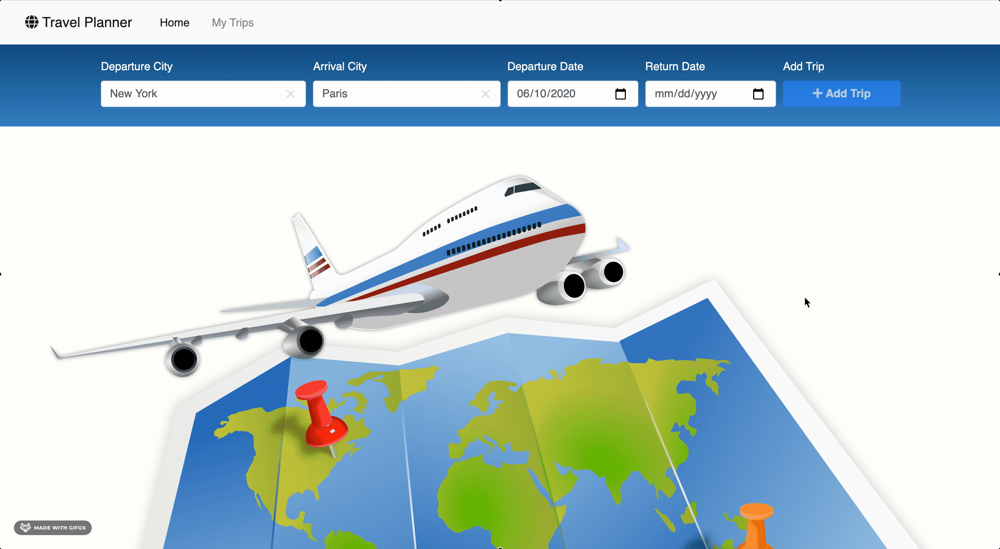

# Travel Planner

## Overview
This project allows users to plan and save travel trips by entering in a departing and arrival city with departing and return dates. The use can delete trip as well. 

## Demo
### City type ahead

### Add trip

### Delete trip

## Running 
### Production
`yarn build-prod && yarn start`
`open browser: http://localhost:3000`

### Development
`node node src/server/server.js`
open another terminal
`yarn build-dev` this will open `http://localhost:9000`

## Running Test
`yarn test`

### API's 
1. Geonames: This is used to get the lat/lng of a city.
2. Pixabay:  This is used to get an image of the city.
3. Dark Sky: Thi is used to retrieve weather data
4. Places API: This is used for city type ahead.

## Extras
1. Add end date and display length of trip.
2. Incorporate icons into forecast.
3. Allow the user to remove the trip.
